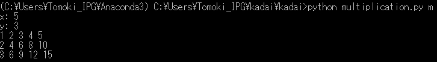
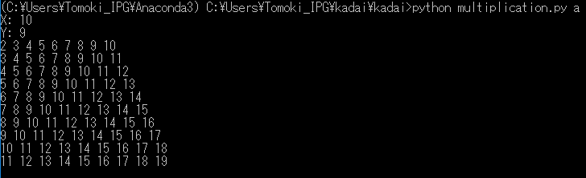

## Overview
Multiplication or addition table can be created by 
## Requirements
- python3.x
## How to install
## How to use
1. Install the required libraries and multiplication.py
2. Execute "python multiplication.py" with  argument "a" (addition table) or "m" (multiplication table)
3.  Input 2 numbers (X and Y)
4. Multiplication (addition) table  $[1...X]\times(+)[1...Y]$ will be shown

## Quick start
 or "m" (multiplication table)")

## license
MIT
## Author
Tomoki Emmei (0699559246.edu.k@u-tokyo.ac.jp)