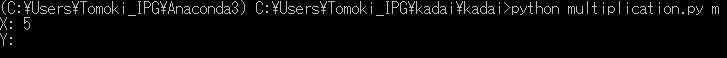

## Overview
multiplication or addition table can be shown
## Requirements
- python3.6
## How to install
## How to use
1. Install the required libraries and multiplication.py
2. Execute "python multiplication.py" with  argument "a" (shows addition table) or "m" (shows multiplication table)
3.  Input 
## Quick start

## license
MIT
## Author
Tomoki Emmei (0699559246.edu.k@u-tokyo.ac.jp)