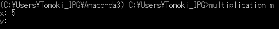
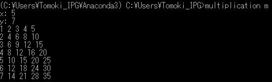
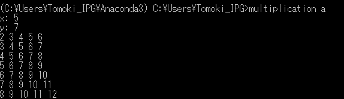

# Kadai: Multiplication
[](https://travis-ci.org/TomokiEmmei/kadai)

## Overview
Multiplication (or addition) table can be created by this program

## Requirements
- python3.x

## How to install
1. Download "multiplication-1.0-py3-none-any.whl" from Releases
2. Install this app as follows
```
$ pip install dist\multiplication-1.0-py3-none-any.whl
```
## How to use
1. Install multiplication.py
2. Execute following command  with  argument "m" (multiplication table) or "a" (addition table)
```
$ multiplication m
```
3.  Input 2 numbers (x and y)
4. Multiplication (addition) table  $[1...x]\times(+)[1...y]$ will be shown

## Quick start



Multiplication table



Addition table



## license
MIT

## Author
Tomoki Emmei (0699559246.edu.k@u-tokyo.ac.jp)